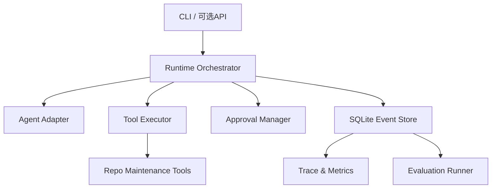

# ReliAgent 需求文档 v1.1

> 面向长任务执行的可靠 Agent Runtime 与自动评测框架

| 项目属性 | 内容 |
|---|---|
| 项目代号 | ReliAgent（暂定，可在开发前改名） |
| 项目类型 | Agent Runtime / Harness / Evaluation Infrastructure |
| 目标岗位 | Agent开发、Agent平台、AI应用开发、Python后端实习 |
| 开发周期 | 2026-09-15—2026-10-09 |
| 计划投入 | 约55小时，允许范围45—60小时 |
| 主要语言 | Python 3.10+ |
| 开发环境 | Mac；A6000服务器仅用于可选真实实验演示 |
| 核心案例 | CI失败诊断与仓库维护工作流 |
| 可选案例 | 轻量机器学习实验复现工作流（P1） |
| 文档状态 | 已完成范围收缩与技术边界修订，待实现前复审 |

---

## 0. v1.1修订结论与求职适配

本项目适合作为Agent平台、Agent应用工程和Python后端方向的求职项目，前提是完成可运行代码、故障注入数据、可复现评测报告和稳定演示。需求文档本身不能替代项目成果，也不应在P0未完成时把模板指标写入简历。

| 评估维度 | 当前判断 |
|---|---:|
| 需求文档完整度 | 8/10 |
| Agent平台/基础设施岗位匹配度 | 8.5/10 |
| AI应用工程岗位匹配度 | 8/10 |
| 算法训练/Agentic RL岗位匹配度 | 5/10 |
| 原v1.0范围在55小时内高质量完成的可行性 | 5/10 |
| 仅有需求文档时的简历价值 | 2/10 |
| 按v1.1收缩范围并完成实证后的预期价值 | 8/10 |

v1.1遵循以下修订原则：

1. 只保留一条可演示、可恢复、可评测的P0闭环；
2. 将CI失败诊断与仓库维护作为旗舰案例，机器学习实验复现降为P1；
3. 不宣称通用Exactly-once，显式处理外部副作用结果未知状态；
4. 将强制超时和取消限定为受控subprocess，避免无法兑现的通用承诺；
5. 明确状态表是恢复事实源、Event是事务内审计记录，不在P0实现完整Event Sourcing；
6. Baseline与Full保持任务、工具、模型和Prompt一致，并同时报告可靠性收益与正常路径开销；
7. 优先保留CoreCoder已有的开源、PyPI、文章和CI资产，避免形成“换名fork”的观感。

---

## 1. 项目背景

### 1.1 求职背景

目标是在2026年10月10日前形成一个可写入简历、可公开展示、可量化说明效果的项目，用于投递Agent开发相关实习。

对15份目标JD的分析显示，岗位普遍要求：

- 扎实的Python与工程开发能力；
- 对Agent Loop、工具调用、规划、上下文和多智能体等机制的理解；
- 完整项目或产品落地经验；
- 长任务稳定执行、评测、观测、成本和可靠性优化能力；
- 部分岗位要求MCP、RAG、API、SSE、CI/CD等工程能力。

本项目优先填补“Agent系统工程、稳定性与评测”能力，不重复堆叠已有的多模态RAG科研经历。

### 1.2 基线项目现状

项目参考并部分演进自CoreCoder。CoreCoder当前已经实现：

- 基础Agent Loop；
- LLM与Tool抽象；
- 并行工具调用；
- 文件、Shell、搜索等内置工具；
- 权限控制、Plan Mode、Todo、Hooks；
- MCP stdio客户端；
- 上下文压缩；
-会话JSON保存与恢复；
- 内存式文件Checkpoint/Undo；
- 同步Sub-agent；
- pytest测试与GitHub Actions。

这些属于上游基线或参考实现，不能作为本项目的原创卖点。本项目必须通过新的状态模型、运行时边界、持久化、恢复和评测体系形成清晰增量。

### 1.3 核心问题

轻量Agent通常能在一次进程内完成“模型—工具—模型”循环，但面对分钟级或更长的任务时，会出现：

1. 进程异常退出后无法知道任务执行到哪一步；
2. 恢复时可能重复执行有副作用的工具；
3. 工具超时、失败、取消和重试缺少统一语义；
4. 只有聊天消息，没有可查询的运行轨迹；
5. 无法稳定比较模型、Prompt或Runtime版本效果；
6. Demo成功不能证明系统可靠。

ReliAgent要解决的是：

> 如何让工具型Agent任务具备可持久化、可审批、可中断恢复、可观测和可评测的执行语义。

---

## 2. 产品定位

### 2.1 一句话定义

ReliAgent是一个Python实现的轻量Agent Runtime与自动评测框架，为工具型长任务提供结构化执行状态、人工审批、故障恢复、Trace记录和回归评测能力。

### 2.2 产品结构

项目由两个层次组成：

1. **通用Runtime层**：状态机、事件、持久化、工具生命周期、审批、恢复、观测和评测。
2. **案例Workflow层**：以CI失败诊断与仓库维护为旗舰案例，验证Runtime能支撑真实、带文件副作用且可通过测试验收的长任务。

仓库维护不是Runtime的硬编码领域。后续可以通过新的Workflow/Skill扩展到机器学习实验复现、求职调研、金融分析和数据处理等场景。

### 2.3 目标用户

- 希望开发可靠工具型Agent的AI应用开发者；
- 需要对Agent进行自动评测和版本比较的开发者；
- 需要执行、监控和审计仓库维护任务的开发者。

### 2.4 核心价值

- **可靠执行**：任务进度不只存在于LLM上下文中；
- **安全控制**：有副作用的操作必须经过明确审批；
- **故障恢复**：进程退出后根据持久化状态继续，而非从头重跑；
- **可观测**：每个模型回合、工具调用和状态变化均可追踪；
- **可评测**：用固定数据集对模型、Prompt和Runtime版本做回归比较。

---

## 3. 项目目标与非目标

### 3.1 P0目标

在三周内完成以下可验证能力：

1. 定义并实现Run、ToolCall两级核心状态模型；
2. 使用SQLite持久化运行状态、工具调用、审批和审计事件，并在同一事务内更新状态与事件；
3. 对subprocess类工具支持超时、有限重试、取消和错误分类；
4. 支持只读操作自动执行、有副作用操作人工审批；
5. 支持进程退出后的Run恢复：已确认成功的调用不重放，状态未知的高风险调用转人工确认；
6. 记录结构化Trace以及Token、耗时、错误、重试和审批等待等指标；
7. 实现自动评测Runner、8—10个确定性故障注入任务和公平的基线对比报告；
8. 实现一个精简的CI失败诊断与仓库维护Workflow；
9. 提供CLI演示、测试、README、架构图和可复现的实验结果。

### 3.2 P1目标

仅在P0全部通过后实施：

- FastAPI查询接口；
- SSE事件流；
- 静态HTML Trace报告；
- MCP工具兼容验证；
- 通用结构化Step与动态重规划；
- 轻量机器学习实验复现Workflow；
- 一个额外的非Coding轻量Workflow；
- 在A6000服务器完成一次真实实验演示。

### 3.3 明确不做

- React/TypeScript前端；
- 低代码拖拽工作流编辑器；
- Kubernetes、Redis、Kafka或分布式Worker；
- 全自动AI Scientist；
- 自动阅读整篇论文并提出研究Idea；
- 模型训练、微调或Post-Training；
- 完整RAG知识库；
- 复杂长期Memory；
- 多层递归Multi-Agent编排；
- 为追求“通用”而接入大量无关工具。
- 对任意外部系统提供Exactly-once副作用保证；
- 强制终止任意Python函数或线程；
- 完整Event Sourcing和事件投影重建框架。

---

## 4. 核心用户流程

### 4.1 通用任务流程

1. 用户通过CLI创建Run，提交目标和工作目录；
2. Runtime持久化Run并启动Agent；
3. Agent产生计划或下一步工具调用；
4. Runtime根据工具策略判断自动执行或进入待审批；
5. 工具执行产生开始、成功、失败、超时或取消事件；
6. Runtime更新状态并将受控结果返回Agent；
7. 异常退出后，用户重新启动CLI并执行resume；
8. Runtime重建状态，只继续未完成且可安全继续的步骤；
9. Run结束后生成Trace和指标摘要；
10. Eval Runner在固定任务集上批量运行并输出对比报告。

### 4.2 CI失败诊断与仓库维护Workflow

第一版输入限定为：

- 已克隆到本地的Python仓库或随项目提供的固定fixture；
- 用户描述的修复目标；
- 本地保存的CI失败日志或用户给定的测试命令；
- 明确的工作目录、允许工具和验收命令。

执行阶段：

1. 只读检查仓库结构、依赖文件、测试目录、Git状态和失败日志；
2. 生成诊断与修复计划，并等待用户批准；
3. 经批准后在临时目录或隔离工作区修改必要文件；
4. 经批准后运行限定的测试或检查命令；
5. 捕获标准输出、标准错误、退出码、执行时长和修改摘要；
6. 对可重试的临时失败按策略重试，对状态未知的副作用停止并请求人工确认；
7. 以测试结果和文件断言验证任务结果；
8. 输出修复结果、恢复记录、Trace和评测摘要。

第一版不连接线上GitHub账号、不自动推送分支或创建PR、不安装未批准的依赖，也不对用户真实仓库执行破坏性清理。机器学习实验复现保留为P1案例，用于验证Runtime的领域可扩展性。

### 4.3 恢复语义边界

ReliAgent不承诺任意外部副作用的Exactly-once。若外部操作已经发生，但进程在成功状态写入SQLite前退出，Runtime只能将调用识别为“结果未知”。P0采用以下语义：

- 已有成功状态和完成事件的ToolCall不得重放；
- 只读且显式声明幂等的ToolCall可以由策略重新调度；
- 支持幂等键或外部状态探测的工具，可以在完成对账后继续；
- 有副作用且结果未知的ToolCall不得自动重放，必须人工确认；
- 简历和文档使用“replay-safe recovery”或“避免自动重放未知高风险调用”，不表述为通用Exactly-once。

---

## 5. 功能需求

### 5.1 Run与状态机

#### FR-RUN-001 创建Run（P0）

用户可通过CLI指定任务目标、工作目录、模型配置和Workflow创建Run。系统生成唯一`run_id`并在执行前持久化。

#### FR-RUN-002 Run状态（P0）

Run至少支持以下状态：

- `created`
- `running`
- `waiting_approval`
- `paused`
- `recoverable`
- `succeeded`
- `failed`
- `cancelled`

状态转换必须由Runtime控制并写入事件表，不能仅由LLM文本声明。

#### FR-RUN-003 恢复Run（P0）

进程重新启动后，用户可列出未完成Run并执行`resume <run_id>`。系统根据已落盘事件重建当前状态。

#### FR-RUN-004 取消Run（P0）

用户可取消正在执行或等待审批的Run。取消请求必须被记录；后续不得启动新工具调用。

### 5.2 Step与计划（P1）

#### FR-STEP-001 结构化步骤（P1）

P1可将已获批准的计划转换为结构化Step，至少包含：`step_id`、`run_id`、`title`、`status`、`sequence`、`attempt_count`和时间戳。P0不要求支持通用的LLM计划解析或动态重规划。

#### FR-STEP-002 Step状态（P1）

Step状态至少包含：`pending`、`running`、`waiting_approval`、`succeeded`、`failed`、`skipped`和`cancelled`。

#### FR-STEP-003 已完成步骤不重复执行（P1）

恢复Run时，所有`succeeded`步骤不得重新执行。系统需通过测试注入崩溃验证这一行为。

### 5.3 工具生命周期

#### FR-TOOL-001 工具元数据（P0）

每个工具除名称、描述和参数Schema外，还必须声明：

- `risk_level`：`read_only`、`mutating`、`external_effect`；
- 默认超时；
- 最大重试次数；
- 是否允许自动重试；
- 输出长度限制。
- `execution_kind`：`in_process`或`subprocess`；
- 是否幂等，以及可选的幂等键或外部状态探测方式。

#### FR-TOOL-002 工具调用状态（P0）

ToolCall至少包含：`created`、`waiting_approval`、`running`、`succeeded`、`failed`、`timed_out`、`cancelled`和`interrupted`。

#### FR-TOOL-003 超时（P0）

subprocess类工具超过配置时间后，Runtime应终止其进程组或将无法确认终止的调用标记为`interrupted`，记录原始错误和持续时间，并返回有界错误结果给Agent。P0不承诺强制终止任意in-process Python函数或线程；这类工具仅支持协作式取消。

#### FR-TOOL-004 重试（P0）

只允许对明确标记为幂等且可重试的失败执行自动重试，例如受控的临时网络错误。文件修改、依赖安装、Git操作和测试启动默认不得静默自动重试。

每次实际执行尝试对应一条独立ToolCall记录。重试创建新的ToolCall，通过`retry_of`指向上一次尝试并增加`attempt`；不得把`failed`或`timed_out`记录重新改回`running`。

#### FR-TOOL-005 输出约束（P0）

写入模型上下文的工具输出必须有长度上限；完整输出可以写入日志文件，Trace保存摘要和文件引用。

### 5.4 权限与审批

#### FR-APPROVAL-001 默认策略（P0）

- 文件读取、目录查看、文本搜索、环境查询：自动允许；
- 文件修改、依赖安装、Shell命令、外部副作用：进入`waiting_approval`；
- 未知风险等级：按高风险处理。

#### FR-APPROVAL-002 审批内容（P0）

审批界面必须展示工具名称、参数摘要、工作目录、风险说明和拟执行命令。用户可选择允许一次或拒绝；“永久允许”不进入P0。

#### FR-APPROVAL-003 恢复期间安全（P0）

进程在高风险工具执行中退出时，该ToolCall标记为`interrupted`。恢复后不得自动重新执行，必须由用户确认当前外部状态并重新审批。

### 5.5 持久化与恢复

#### FR-STORE-001 SQLite状态与审计存储（P0）

Runtime使用SQLite保存Run、ToolCall、Approval、Event和Metric；Step为P1实体。P0以Run、ToolCall等状态表作为恢复事实源，以append-only Event作为审计记录，不实现完整Event Sourcing。禁止只依赖内存状态或完整消息JSON覆盖写入。

#### FR-STORE-002 原子写入（P0）

关键状态更新和对应事件必须在同一事务中提交，避免状态已改变但事件缺失，或事件存在但状态未更新。恢复直接读取状态表，并使用事件检查审计完整性。

#### FR-STORE-003 恢复策略（P0）

启动时在事务中将遗留的`running`调用识别为`interrupted`：

- 已有成功结束事件：恢复为成功；
- 只读且声明幂等：可经Runtime策略重新调度；
- 有副作用或状态未知：转人工确认；
- 支持幂等键或外部状态探测：完成对账后再决定跳过或重试；
- 已完成ToolCall：跳过。

### 5.6 Trace与观测

#### FR-TRACE-001 结构化事件（P0）

至少记录以下事件：

- `run.created`
- `run.started`
- `run.paused`
- `run.resumed`
- `run.completed`
- `approval.requested`
- `approval.resolved`
- `model.started`
- `model.completed`
- `tool.started`
- `tool.completed`
- `tool.failed`
- `tool.timed_out`
- `tool.retry_scheduled`
- `run.cancelled`

P1引入结构化Step后，再增加`step.started`和`step.completed`事件。

#### FR-TRACE-002 Trace查询（P0）

CLI支持按Run展示时间顺序Trace，并可导出JSON。敏感环境变量和API Key不得写入Trace。

#### FR-TRACE-003 指标（P0）

每个Run至少统计：

- 端到端耗时；
- 模型调用次数；
- 输入/输出Token；
- 估算调用成本；
- 工具调用次数和成功率；
- 超时和重试次数；
- 等待审批时长；
- 最终状态。

### 5.7 自动评测

#### FR-EVAL-001 任务集格式（P0）

评测任务使用YAML或JSON定义，至少包含：任务ID、目标、工作目录模板、允许工具、超时、预期结果和清理方式。

#### FR-EVAL-002 确定性断言（P0）

优先使用可复现断言：文件是否存在、退出码、测试是否通过、指标范围、事件顺序和副作用次数。LLM-as-a-Judge不作为P0核心指标。

#### FR-EVAL-003 版本对比（P0）

Eval Runner可以比较至少两个配置，例如：

- 原始CoreCoder式基线；
- ReliAgent完整Runtime；
- 不启用恢复或不启用重试的消融配置。

#### FR-EVAL-004 报告（P0）

输出Markdown或JSON报告，包含任务成功率、恢复成功率、已确认副作用重复次数、未知高风险调用自动重放次数、平均耗时、Token和成本。

### 5.8 CI失败诊断与仓库维护Workflow

#### FR-REPO-001 仓库检查（P0）

识别README、依赖文件、测试目录、Git状态、CI失败日志和用户给定的验收命令。

#### FR-REPO-002 诊断计划（P0）

在任何修改或命令执行前生成结构化诊断与修复计划，列出预期修改、风险、验证命令和停止条件，并等待审批。

#### FR-REPO-003 隔离修改（P0）

所有演示任务必须在fixture副本、临时目录或明确的隔离工作区内修改；不得默认修改用户主工作区，不得执行自动推送或创建PR。

#### FR-REPO-004 测试执行与结果采集（P0）

经审批后运行限定的测试或检查命令，捕获stdout、stderr、退出码、执行时长和超时/取消结果。验收优先使用测试退出码和文件断言。

#### FR-REPO-005 修复报告（P0）

报告至少包含失败摘要、诊断计划、代码/配置变化、运行命令、错误与恢复记录、测试结果、Trace引用和最终结论。

### 5.9 服务接口

#### FR-API-001 FastAPI只读接口（P1）

提供Run列表、Run详情、Trace和Metrics查询接口。P1阶段不通过API执行高风险审批。

#### FR-API-002 SSE（P1）

支持订阅指定Run的事件流，用于演示实时状态变化。

---

## 6. 非功能需求

### 6.1 可靠性

- 所有确定性单元和集成测试必须通过；
- 任意状态转换必须留下事件记录；
- 恢复后不得重复执行已有成功状态的ToolCall；
- 结果未知的高风险ToolCall不得自动重放；
- 高风险中断调用不得自动重放；
- 单个工具异常不得导致数据库损坏。

### 6.2 安全性

- API Key只从环境变量读取；
- 日志与Trace必须脱敏；
- 工作目录必须显式指定并解析为绝对路径；
- 禁止默认在用户主目录或根目录执行递归操作；
- 安装、写入和Shell任务运行必须审批；
- 演示任务在fixture副本、独立虚拟环境、临时目录或隔离工作区运行；
- subprocess类工具应使用独立进程组，取消时不得只终止父进程而遗留子进程。

### 6.3 可维护性

- Runtime核心不得依赖仓库维护Workflow；
- 状态枚举、事件Schema和数据库访问集中定义；
- 每个P0模块至少有对应测试；
- 保持Python类型注解；
- 不为了“架构感”引入消息队列或微服务。

### 6.4 可复现性

- 固定Python和关键依赖版本；
- 评测任务固定仓库提交或随项目提供fixture副本；
- 报告记录模型、Prompt版本和Runtime Git Commit；
- 同一确定性故障注入测试应产生一致结果。

---

## 7. 系统架构

### 7.1 逻辑架构



### 7.2 设计原则

1. **LLM负责决策，Runtime负责事实状态。**
2. **状态负责恢复，事件负责审计。** P0以事务化状态表为恢复事实源，append-only Event记录同一状态转换；CLI、报告和未来API读取同一持久化数据。
3. **高风险操作默认不可重放。** 不把“重试”误用在有副作用操作上。
4. **Workflow依赖Runtime，Runtime不依赖Workflow。**
5. **先做单进程可靠性，再谈分布式扩展。**
6. **不伪造Exactly-once。** 对结果未知的外部副作用采用幂等、对账或人工确认，而不是静默重放。
7. **可取消能力显式声明。** P0只对受控subprocess提供强制终止；其他工具采用协作式取消。

### 7.3 建议目录结构

```text
reliagent/
├── runtime/
│   ├── engine.py
│   ├── state.py
│   ├── events.py
│   ├── recovery.py
│   └── policies.py
├── agents/
│   └── corecoder_adapter.py
├── tools/
│   ├── base.py
│   ├── executor.py
│   └── metadata.py
├── approvals/
│   └── manager.py
├── storage/
│   ├── schema.py
│   └── sqlite_store.py
├── tracing/
│   ├── collector.py
│   └── report.py
├── evals/
│   ├── runner.py
│   ├── assertions.py
│   └── datasets/
├── workflows/
│   └── repo_maintenance/
├── cli.py
└── api.py                 # P1
tests/
examples/
docs/
THIRD_PARTY_NOTICES.md
README.md
pyproject.toml
```

---

## 8. 数据模型

### 8.1 核心实体

| 实体 | 关键字段 |
|---|---|
| Run | id、goal、workflow、status、workspace、model、prompt_version、created_at、updated_at |
| Step（P1） | id、run_id、sequence、title、status、attempt_count、started_at、ended_at |
| ToolCall | id、run_id、可选step_id、retry_of、tool_name、arguments、risk_level、execution_kind、idempotent、idempotency_key、status、attempt、timeout、result_summary |
| Approval | id、tool_call_id、status、decision、requested_at、resolved_at |
| Event | id、run_id、sequence、type、payload、created_at |
| Metric | id、run_id、name、value、unit、created_at |

### 8.2 一致性要求

- 同一Run内Event的`sequence`单调递增；
- Run和ToolCall终态不可回退到运行态；
- ToolCall执行前必须已有持久化记录；
- 高风险ToolCall执行前必须存在通过的Approval；
- 事件payload只保留必要信息，参数中的密钥必须脱敏。
- 状态更新和对应Event在同一SQLite事务中提交；
- 恢复读取状态表，Event用于审计和完整性校验，不要求全量事件重放；
- 外部副作用发生但结果未落盘时，ToolCall进入`interrupted`，不得推断为成功或自动重试。
- ToolCall的一次attempt只有一次从`created`进入执行态的机会；重试必须创建新记录并通过`retry_of`关联。

---

## 9. 评测方案

### 9.1 评测目标

评测不是衡量“大模型是否聪明”，而是验证Runtime是否使任务执行更可靠、可解释和可比较。

### 9.2 测试集组成

#### A. 8—10个确定性故障注入任务（必须）

至少覆盖：

1. 正常工具成功；
2. 可重试错误后成功；
3. 达到最大重试次数；
4. subprocess超时并清理进程组；
5. 用户拒绝审批，以及等待审批时进程退出；
6. ToolCall成功落盘后进程退出；
7. 高风险工具运行中退出后进入结果未知状态；
8. Run取消后不再启动新调用；
9. 工具输出截断且完整日志仍可追溯；
10. Trace脱敏、事件顺序和状态一致性。

#### B. 1—2个仓库维护任务（必须）

- 数分钟内完成；
- 使用随项目提供的fixture副本，或固定到明确Commit的公开Python仓库；
- 至少一个任务包含人为制造的测试失败；
- 使用确定性测试和文件断言验收；
- 不连接线上GitHub账号，不依赖不稳定的外部服务。

#### C. 轻量ML实验复现（P1可选）

仅用于验证Workflow扩展性，演示环境检查、任务规划、启动小规模脚本和日志/指标记录，不要求在P0完成RegionRAG或其他大型实验复现。

### 9.3 核心指标

| 指标 | 定义 |
|---|---|
| Task Success Rate | 满足任务确定性断言的任务数/总任务数 |
| Recovery Success Rate | 故障后恢复并完成的任务数/可恢复任务数 |
| Duplicate Confirmed Side Effects | 已确认成功并落盘后，在恢复过程中被重复执行的副作用操作数 |
| Unknown-effect Auto-replay | 状态未知的高风险调用被自动重放的次数，目标为0 |
| Trace Completeness | 实际生命周期节点中存在对应事件的比例 |
| Tool Success Rate | 成功ToolCall数/全部终结ToolCall数 |
| Timeout/Retry Count | 每个任务的超时和重试次数 |
| Latency | Run端到端耗时及工具执行耗时 |
| Token/Cost | 每个Run的Token和估算成本 |

### 9.4 对比实验

至少完成以下对比：

1. **Baseline**：使用与Full相同的任务、工具、模型和Prompt，但不启用持久化恢复；
2. **ReliAgent Full**：在其余配置相同的前提下，开启状态、事件、恢复、审批和Trace；
3. **Ablation（时间允许）**：仅关闭恢复或重试策略中的一项，不同时改变多个变量。

主要对比故障后的完成率、已确认副作用重复次数、未知高风险调用自动重放次数、Trace完整性和执行开销。同时报告无故障正常路径的延迟、Token和SQLite写入开销，避免只选择必然有利于Full的指标。不以主观LLM评分作为核心结论。

### 9.5 P0验收阈值

- 确定性测试：全部通过；
- 已确认成功ToolCall恢复后重复执行次数：0；
- 结果未知的高风险ToolCall自动重放次数：0；
- 未审批高风险ToolCall实际执行次数：0；
- 必需生命周期事件Trace完整率：100%；
- 超时和最大重试策略：全部对应测试通过；
- 至少1个仓库维护端到端任务成功完成；
- 至少1个受控崩溃任务成功恢复；
- 生成可读的Markdown评测报告。

---

## 10. 三周开发计划

### 阶段0：准备与归属（约3小时，9.15）

- 确定承载方式：优先在CoreCoder中建立边界清晰的增量模块；如使用独立仓库，则通过Adapter依赖CoreCoder并避免复制非必要代码；
- 明确MIT许可和上游归属；
- 创建`THIRD_PARTY_NOTICES.md`；
- 只迁移必要代码或建立适配层；
- 建立README中的“Upstream与原创改动”章节。

验收：仓库归属透明，能够清楚说明哪些代码来自上游。

### 第1周：运行时骨架（约10—12小时，9.15—9.21）

- 学习pytest基础并建立测试结构；
- 定义Run/ToolCall状态及转换；
- 定义Event Schema；
- 使用SQLite实现最小Store；
- 明确状态表为恢复事实源、Event为事务内审计记录；
- 将CoreCoder执行过程接入Runtime边界；
- 完成创建Run、执行、查询状态的闭环。

验收：一个简单工具任务能产生持久化Run、ToolCall和Event，且状态更新与事件写入位于同一事务。

### 第2周：可靠执行（约18—20小时，9.22—9.28）

- 实现风险等级和审批；
- 为subprocess工具实现进程组级超时、取消、错误分类和有限重试；
- 实现启动恢复扫描；
- 实现已完成ToolCall跳过和中断高风险调用人工确认；
- 构建确定性故障注入测试。

验收：杀死进程后可恢复受控任务；已确认成功的调用不重放，结果未知的高风险调用不会自动重放。

### 第3周：评测与仓库维护案例（约16—18小时，9.29—10.5）

- 实现Trace查询和指标汇总；
- 实现Eval任务格式、Runner和断言；
- 实现CI失败诊断与仓库维护Workflow；
- 完成至少1个仓库维护端到端任务；
- 运行公平的Baseline/Full对比；有余量再增加单变量Ablation。

验收：生成包含真实数据的评测报告。

### 收尾：求职交付（约6—8小时，10.6—10.9）

- 补齐README、快速开始和架构图；
- 整理测试和GitHub Actions；
- 录制3—5分钟演示；
- 整理关键设计决策；
- 根据实测指标撰写简历项目描述；
- P0完成后若有余量，再增加FastAPI/SSE。

验收：陌生用户能按README运行一个Demo；简历中的每项指标均能在仓库中找到证据。

### 建议时间分配

| 工作 | 预算 |
|---|---:|
| 理解与设计 | 5小时 |
| pytest与测试数据 | 7小时 |
| 状态机与SQLite | 10小时 |
| subprocess生命周期与恢复 | 11小时 |
| Trace与自动评测 | 8小时 |
| 仓库维护Workflow | 4小时 |
| README、演示与简历 | 6小时 |
| 缓冲与问题修复 | 4小时 |
| 合计 | 55小时 |

---

## 11. 优先级与砍需求顺序

如果进度不足，按以下顺序删减：

1. 不实施A6000和机器学习复现案例；
2. 不实施额外非Coding Workflow；
3. 不实施SSE和静态HTML报告；
4. 不实施FastAPI；
5. 将Ablation降为P1，只保留公平的Baseline/Full；
6. 将故障注入任务收缩到8个，但保留每类核心恢复边界；
7. 减少指标展示形式，但保留JSON/Markdown输出。

不得删除：SQLite状态与事务内Event、恢复安全策略、审批、subprocess超时/取消、Trace、评测Runner和至少一个仓库维护Workflow。它们构成项目差异化闭环。

---

## 12. 风险与应对

| 风险 | 影响 | 应对 |
|---|---|---|
| 对CoreCoder改动不足 | 项目仍像直接fork | 独立仓库、原创Runtime模块、清晰归属与差异表 |
| 同时学习技术过多 | 三周无法完成 | P0仅Python、pytest、SQLite；API为P1 |
| 恢复语义设计过重 | 陷入分布式系统复杂度 | 单进程、单SQLite，以状态表恢复、Event审计，不做完整Event Sourcing或Worker集群 |
| 外部副作用发生但未落盘 | Runtime无法判断调用是否成功 | 标记为`interrupted`；只对幂等或可对账工具恢复，其他情况人工确认，不承诺Exactly-once |
| subprocess无法完整终止 | 遗留子进程继续产生副作用 | 独立进程组、TERM/KILL升级策略和终止后检查；in-process工具仅协作式取消 |
| 状态表与Event不一致 | 恢复错误或Trace失真 | 状态更新与审计事件使用同一SQLite事务，并用一致性测试覆盖 |
| 高风险工具重复执行 | 破坏环境或污染仓库 | 高风险默认不自动重试，中断后人工确认，演示在fixture副本或隔离工作区运行 |
| Workflow像脚本包装 | Agent必要性和业务价值不足 | 使用真实CI失败诊断、计划审批、受控修改、测试验证和故障恢复形成闭环 |
| 模型输出不稳定 | 评测结果难复现 | 核心使用确定性故障注入和规则断言 |
| 指标提前编造 | 简历可信度受损 | 只在完整评测后填写实际数据 |
| 服务器资源风险 | 影响共享机器 | A6000仅P1演示，限制进程、时长与工作目录 |

---

## 13. 与参考项目的关系

### 13.1 CoreCoder

优先通过公开Adapter依赖CoreCoder的最小Agent Loop、LLM/Tool抽象及必要工具，减少复制代码和“换名fork”的观感。若确需复制代码，必须保留许可证与提交来源。ReliAgent的新增集中在Runtime、事件、持久化、恢复和评测，不把上游已有MCP、Hooks、Plan Mode等写成原创。

### 13.2 Claude Code

参考其Agent Loop、工具权限、上下文和任务执行理念。由于Claude Code完整实现和生产系统边界不可直接等同于本项目，本项目只实现可验证的最小机制。

### 13.3 OpenCode

重点参考：Session状态与事件分离、工具超时/取消、可持久化运行历史。不得照搬其完整客户端、服务器和SDK体系。

### 13.4 OpenClaw

重点参考：工作区内容与Runtime私有状态分离、可扩展Skill边界。不得引入其多平台Gateway、Channel和大规模插件生态。

### 13.5 归属要求

- 保留所有复制代码对应的原许可证和版权信息；
- README明确列出上游链接、借鉴范围和原创模块；
- Git提交从“基线导入”开始，后续每个功能独立提交；
- 简历使用“基于/参考……设计并扩展”，不得表述为从零原创全部Agent能力。

---

## 14. 项目交付物

P0最终必须交付：

1. 独立GitHub公开仓库，或CoreCoder仓库中边界清晰的`runtime/evals`增量模块；
2. 可安装Python包和CLI；
3. SQLite状态与Trace数据库；
4. 8—10个故障注入任务及对应自动化测试；
5. 至少1个仓库维护端到端任务；
6. 公平的Baseline/Full评测报告；时间允许再增加单变量Ablation；
7. 系统架构图和状态机说明；
8. 3—5分钟演示视频或GIF；
9. 中文或英文README；
10. 可追溯到评测结果的简历描述。

---

## 15. 演示脚本

最终演示控制在3—5分钟：

1. 从固定CI失败日志和仓库fixture创建修复Run；
2. 展示自动只读检查和结构化诊断计划；
3. 展示高风险命令进入审批；
4. 修改fixture并运行限定测试，同时显示结构化事件；
5. 人为中断进程；
6. 重新启动并恢复Run；
7. 展示已确认成功的ToolCall未重复执行，以及状态未知的高风险调用没有自动重放；
8. 输出测试结果、指标、成本和Trace报告；
9. 展示Baseline与ReliAgent故障恢复结果对比。

演示重点是“可靠性证据”，不是展示模型生成了大量代码。

---

## 16. 简历表述模板

以下内容必须在评测完成后用真实数字替换：

> **ReliAgent｜面向长任务执行的可靠Agent Runtime与自动评测框架**
>
> - 基于Python设计工具型Agent运行时，引入Run/ToolCall状态机和SQLite事务化状态持久化，实现人工审批、subprocess超时/取消、有限重试及进程中断恢复。
> - 构建结构化Trace与指标采集链路，记录模型调用、工具状态、Token、延迟和成本，并通过CI失败诊断与仓库维护Workflow验证长任务执行能力。
> - 设计`[N]`项确定性故障注入任务和`[M]`项端到端实验，在任务、工具、模型和Prompt一致的条件下对比进程内基线与完整Runtime，使故障恢复成功率由`[A]%`提升至`[B]%`，已确认副作用重复执行为`[C]`次，未知高风险调用自动重放为0次。
> - 使用pytest构建状态一致性、权限和恢复测试，并通过GitHub Actions执行自动回归；项目保留上游MIT归属并明确原创模块边界。

---

## 17. 完成定义

满足以下条件时，项目可以进入简历并开始投递：

- P0核心验收阈值全部满足；
- GitHub中存在连续、可解释的个人提交记录；
- README能让他人在30分钟内运行最小Demo；
- 演示能稳定复现中断—恢复流程；
- 评测报告包含真实数字和实验配置；
- 能清楚回答“为什么不用LangGraph”“崩溃发生在副作用执行与状态提交之间怎么办”“如何终止subprocess及其子进程”“状态表与Event谁是事实源”“如何保证基线对比公平”；
- 简历不宣称通用Exactly-once，而是准确说明幂等、对账、人工确认和replay-safe recovery的边界；
- 简历未将CoreCoder已有功能写成自己的原创实现。

P1未完成不影响10月10日开始投递。
