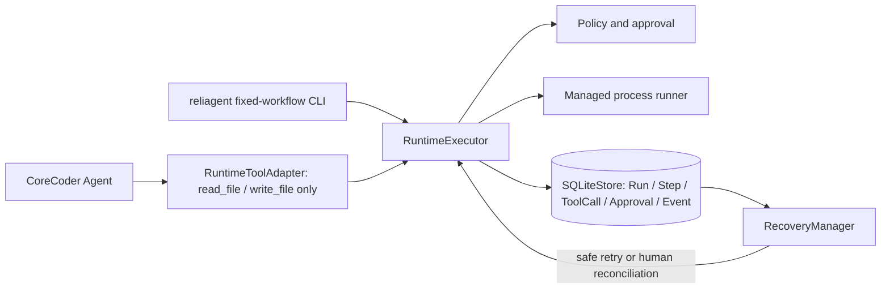
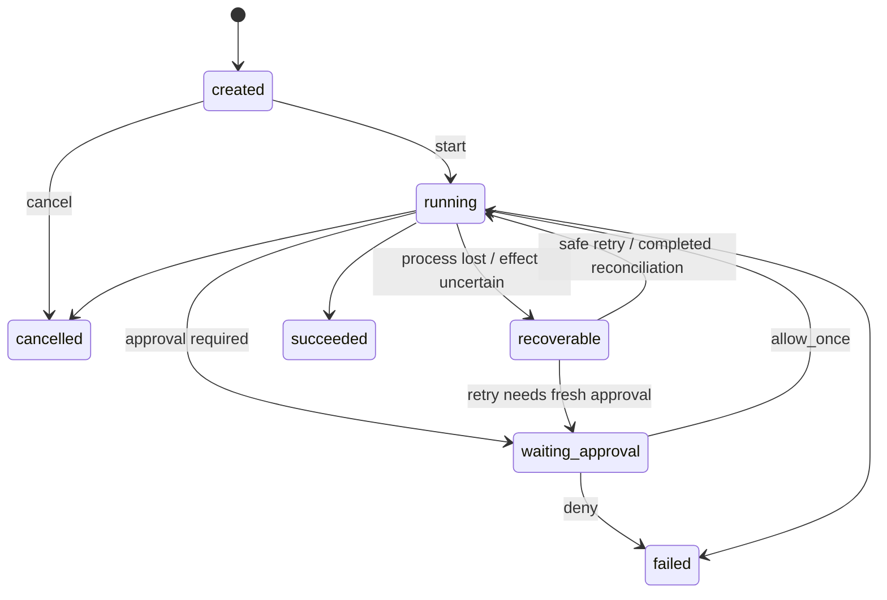

# ReliAgent Architecture and State Machines

## Current P0 delivery boundary

ReliAgent is a reliability Runtime layered onto the CoreCoder fork. Its source
of truth is the SQLite store, which persists Run, Step, ToolCall, Approval, and
Event facts. The default CoreCoder Agent path is deliberately narrow: only
`read_file` and `write_file` are wrapped by `RuntimeToolAdapter`. The other
Agent tools do not yet enter this Runtime boundary.

The Runtime records `tool.started` before subprocess launch and a terminal
observation afterward. An approval is bound to one ToolCall attempt and its
stored arguments. Recovery classifies persisted orphans and does not replay an
uncertain external effect automatically.

## Comparison and deferred work

Evaluation compares three internal Runtime configurations:
`no_retry_no_recovery`, `full`, and `no_recovery`. It is not an external
baseline comparison. The current P0 scope provides one fixed local workflow;
a second workflow, an external baseline, and P1 Metrics/Trace provenance are
deferred. Do not represent this document as evidence that strict-v2 is
complete.

## Run state machine

## Claim boundaries

- SQLite transactions make related Runtime facts atomic, but cannot include an
  external side effect in the same transaction.
- A local fixture artifact and Effect Marker can show that fixture was not
  replayed in its tested scenario; this is not a general exactly-once guarantee.
- Cancellation closes admission before signalling work, but cannot roll back an
  already-observed side effect.
- Runtime token and cost remain unavailable because Run-scoped LLM telemetry is
  not persisted.

## Legacy evidence

`evidence/reliagent/c724f8a/` and commit
`c724f8a4bc45c8ad900040f46fd306d78039279a` are legacy, superseded snapshot
material. They remain available for historical inspection, not as a statement
that the current source or delivery boundary is identical.
