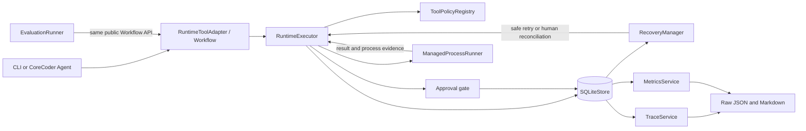
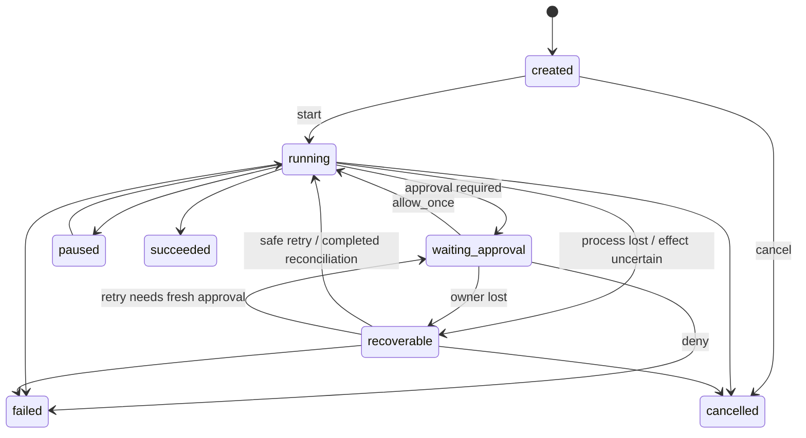

# ReliAgent Architecture and State Machines

The evaluated Runtime snapshot is commit
`c724f8a4bc45c8ad900040f46fd306d78039279a`. The diagrams describe that
snapshot; the evidence bundle that cites it lives under
`evidence/reliagent/c724f8a/`.

## Runtime architecture



The Store is the fact source. The Runtime commits `tool.started` before a
subprocess is launched and records a terminal observation afterward. Approval
is bound to one ToolCall attempt, stored arguments, workspace, experiment ID,
and workflow definition hash. Recovery classifies persisted orphans; it does
not replay an uncertain external effect automatically.

## Run state machine



## ToolCall lineage and effect boundary

```mermaid
sequenceDiagram
    participant A as Agent / Workflow
    participant R as RuntimeExecutor
    participant S as SQLiteStore
    participant P as Subprocess
    participant H as Human

    A->>R: submit run_experiment
    R->>S: ToolCall attempt 1 + Approval
    S-->>A: waiting_approval
    H->>S: allow_once for attempt 1
    A->>R: execute approved attempt
    R->>S: tool.started
    R->>P: spawn fixture
    P-->>R: artifact and effect marker completed
    R->>S: process evidence
    Note over R,S: injected process loss before tool.completed
    A->>S: startup recovery scan
    S-->>H: recoverable / human_required
    H->>S: reconcile completed from artifact evidence
    S->>S: tool.reconciled + step.completed + run.resumed
    Note over P,S: no second experiment process; marker count remains 1
```

## Transaction and claim boundaries

- SQLite transactions make related Runtime facts atomic, but SQLite and an
  external side effect cannot share one transaction.
- A confirmed artifact plus Effect Marker can prove that the deterministic
  fixture was not replayed in the tested scenario. It does not prove general
  exactly-once execution for arbitrary tools or services.
- Cancellation closes admission before signalling active work. If a process
  naturally completes in the cancellation race, the ToolCall keeps the
  observed success while the owning Step and Run remain cancelled.
- Runtime token and cost remain unavailable because Run-scoped LLM telemetry
  is not persisted.
